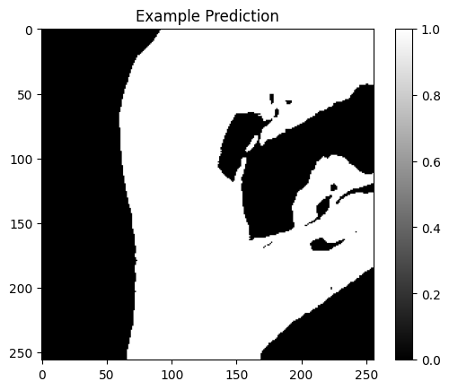

# RiverSeg

**RiverSeg** is a Python pipeline for **segmenting river surface water from satellite imagery** using deep learning, with an explicit focus on **topologically consistent predictions**.

The project aims to produce **robust binary river masks** that preserve river continuity and structure, making them suitable as input for downstream vectorization or graph-based analyses.

This repository contains:
- A reproducible **preprocessing pipeline**
- A **trained segmentation model** for inference
- Scripts and examples to run predictions on sample data

> In a companion repository, **mask2graph**, tools to convert binary masks into graph representations can be found.


While this repository focuses on mask prediction, the design choices (loss functions, preprocessing, postprocessing) are informed by downstream **topological requirements**.

---

## Features
- Satellite image preprocessing (band selection, normalization, tiling)
- Deep learning–based river segmentation (U-Net–style architecture)
- Inference on image patches
- Output of binary river masks (GeoTIFF)

---

## Quickstart

### 1. Clone the repository
```bash
git clone https://github.com/mort607e/riverseg.git
cd riverseg
```

### 2. Install dependencies
```bash
pip install -r requirements.txt
```

### 3. Download pretrained model weights

### 4. Go through the example notebook

---

## Example Output

---

## Data
The segmantation model only takes 9 spectral bands as input. These bands are:

| Channel | Band | Description                     | Resolution |
|--------:|------|---------------------------------|------------|
| 0 | VV  | Sentinel-1 Vertical-Vertical     | 10 m |
| 1 | VH  | Sentinel-1 Vertical-Horizontal  | 10 m |
| 2 | B2  | Blue                             | 10 m |
| 3 | B3  | Green                            | 10 m |
| 4 | B4  | Red                              | 10 m |
| 5 | B6  | Vegetation Red Edge              | 20 m |
| 6 | B7  | Vegetation Red Edge              | 20 m |
| 7 | B8  | Near Infrared (NIR)              | 10 m |
| 8 | B11 | Short-Wave Infrared (SWIR-1)     | 20 m |

---
## Model
The segmentation model is based on a **U-Net–style architecture**, trained on satellite imagery with **pseudo-labels derived from spectral water indices**.

- **Input:** preprocessed satellite image patches  
- **Output:** binary river mask  
- **Loss functions:** Dice and clDice (see `TRAINING.md`)

Pretrained weights are provided via a download script.
[https://drive.google.com/file/d/1gY2lPNDcrQGu5-Hqzlb54rHnCugfm_U2/view?usp=sharing](https://drive.google.com/file/d/1gY2lPNDcrQGu5-Hqzlb54rHnCugfm_U2/view?usp=sharing)


---

## Note
- Trained using pseudo-labels derived from spectral indices (not manual annotations)
- Performance varies across environments (e.g. ice, wetlands, cloud cover)
- The training code is NOT included in this repository. If interested, please reach out.
---

## Related Work
- **Mask → graph conversion:** see the companion repository **mask2graph**  
  *(link will be added)*

---

## Citation
If you use this code in academic work, please cite:

> M. M. Christensen,  
> *River segmentation and graph extraction from multimodal satellite imagery*,  
> MSc Thesis, Technical University of Denmark (DTU), 2025.

---

## License
This project is released under the **MIT License**.
